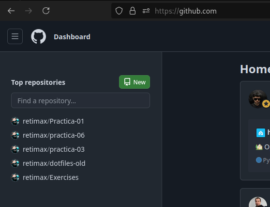

## ¿Cómo se inicializa un repositorio en Git?
Para inicializar un repositorio en _Git_ utilizamos el siguiente comando:

```bash
git init
```

## ¿Cómo creas un repositorio en GitHub?
Para crear un repositorio en _GitHub_ tienes que entrar en dicha [pagina](https://github.com/dashboard) y darle click al boton de *New*:



## ¿Cómo vinculas un repositorio local de Git con uno remoto en GitHub?
Para vincular un repositorio local a uno remoto se usa este comando:

```bash
git remote add origin <url del repositorio>
```

## ¿Cuál es el flujo básico de trabajo en Git y GitHub?
Esta conformado por tres comandos: 


```bash
git add
git commit
git push
```

Estos tres comandos se encargan de:
1. Agregar cambios del repositorio al stage
2. Guardar los cambios en el HEAD Local
3. Mandar los cambios a tu repositorio remoto

## ¿Para qué sirve el archivo .gitignore?
Este archivo sirve para ignorar archivos que no queremos que se vean reflejados en el repositorio remoto, su sintaxis es simplemente poner el nombre de el archivo o la extensión si es que queremos ignorar mas de un archivo de misma extensión:

```
# Asi se coloca un comentario en un archivo .gitignore

# Ignorar extensiones
*.exe

# Ignorar archivo
archivo.txt

# Ignorar carpeta
nombreCarpeta
```

## ¿Cuál es el propósito de una rama?
Poder realizar cambios a un repositorio sin que se vea afectada la rama principal, para posteriormente luego de una revision incluir los cambios aceptados en esta, para crear y cambiarse a una rama se utilizan los siguientes comandos:

```bash
# Para crear una rama
git branch <nombre de la rama>

# Para cambiarse de rama
git checkout <nombre de la rama>
```

## ¿Qué es una fusión?
Es cuando mezclas los cambios de una rama en otra, con el siguiente comando:

```bash
git merge <rama a fusionar>
```

**En este concepto de las fusiones existen dos tipos:**
_Fast Forward:_ Es cuando no hay conflictos entre las ramas fucionadas, asi que los cambios se aplican automaticamente.
_Manual Merge:_ Esta se da cuando hay conflictos entre dichas ramas fucionadas, lo que implica seleccionar los cambios manualmente.

## ¿Cómo puedes ver el historial de tu repositorio?
Con el comando `git log`

## ¿Cuál es el propósito de una etiqueta?
Versionar nuestro codigo, para agregar una etiqueta y hacer push de dicha se escribe lo siguiente:

```
git tag <numero de versión> -m "Mensaje de la etiqueta"
git push --tags
```
